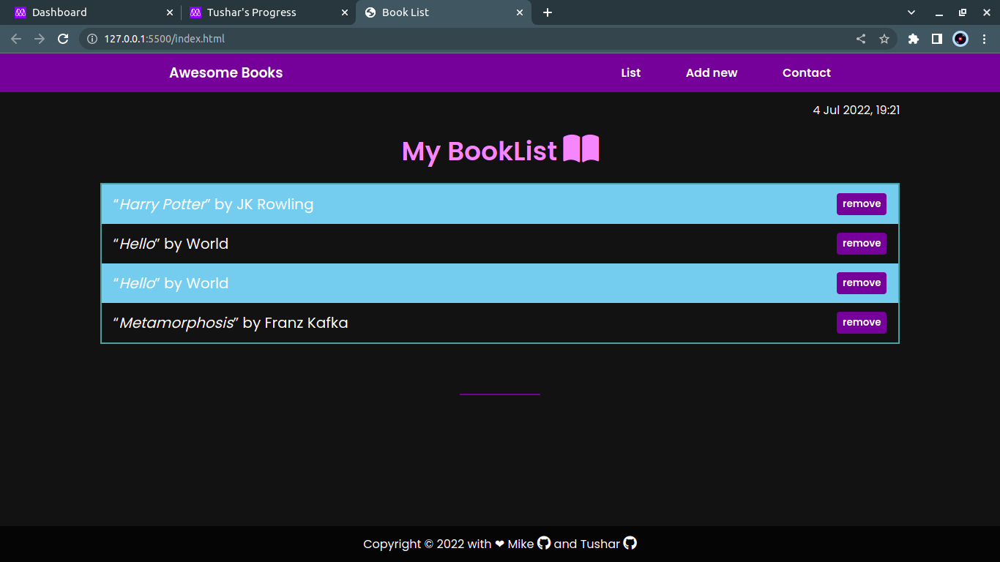

# bookList-website

This is a project to help you find and remember the best books you read.
You can add favourite books, or books you'd like to read, you can create a book collection and this information will be stored and saved for you even if the browser is closed, you can access your collection anytime anywhere, a must have app with easy UI/UX.

# Project Name : Awesome Books ♻️




## Built With

- HTML 
- CSS
- Javascript(ES6 modules)
- Git & GitHub

## Live Demo link

[Live Demo Link](https://pinkmoon25.github.io/AwesomeBooks-ES6/)


To get a local copy up and running follow these simple example steps.

### Prerequisites
have a working git on your localmachine.
## Install
To get a working local copy up and running follow these simple steps
- open terminal
- clone this project with the command:


```
$ git clone git@github.com:PinkMoon25/AwesomeBooks-ES6.git
```
- Finally, run the next command in the terminal to see the web app in your local browser, or also, you can use Live Server in Visual Studio Code.
```
$ npm start
```
### Usage
For anyone that whats to learn html & css & Js


## Authors

👤 **Tushar Singh **

- GitHub: [@PinkMoon25](https://github.com/PinkMoon25/)
- Twitter: [@twitterhandle](https://twitter.com/TusharS90674484)
- LinkedIn: [LinkedIn](https://www.linkedin.com/in/tushar-singh-6b063a14b/)

## 🤝 Contributing

Contributions, issues, and feature requests are welcome!

Feel free to check the [issues page](https://github.com/PinkMoon25/books-website/issues).

## Show your support

Give a ⭐️ if you like this project!

## Acknowledgments

- Hat tip to anyone whose code was used
- Inspiration 💘
- Microverse program ⚡
- My standup team 🏹
- My family's support 🙌

## 📝 License

This project is [MIT](./MIT.md) licensed.